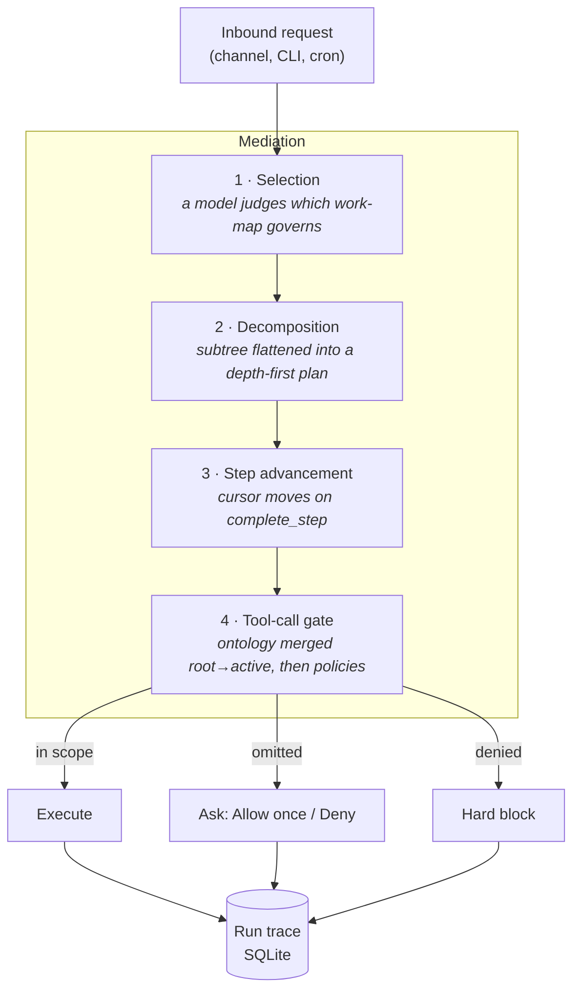

# 🦞 ClawWorks

<p align="center">
    <picture>
        <source media="(prefers-color-scheme: light)" srcset="https://raw.githubusercontent.com/JY-1019/ClawWorks/main/docs/assets/openclaw-logo-text-dark.svg">
        
    </picture>
</p>

<p align="center">
  <strong>Governed AI operations.</strong><br />
  Every agent run bound to a work-map, gated by policy, written to an audit trace.
</p>

<p align="center">
  <a href="LICENSE"></a>
  
  
  <a href="https://github.com/openclaw/openclaw">
  </a>
</p>

<p align="center">
  <a href="#why-clawworks-exists">Why</a> ·
  <a href="#how-it-works">How it works</a> ·
  <a href="#quick-start">Quick start</a> ·
  <a href="#authoring-a-work-map">Authoring</a> ·
  <a href="#built-on-openclaw">Upstream</a> ·
  <a href="docs/concepts/clawworks-enterprise.md">Docs</a>
</p>

---

## Why ClawWorks exists

A capable agent connected to your real systems creates a problem that better prompting does not
solve: **you cannot say afterward what it was allowed to do.**

Ask a stock agent deployment the questions an operator actually needs answered —

- Which step of the process was this run on when it called that tool?
- Was it *supposed* to be able to reach the refund API from there?
- What did it ask for and get refused?
- Which document did that claim come from?

— and the honest answer is a transcript to read and a guess to make. Permissions live in one
place, business process lives in someone's head, and the audit trail is chat history.

ClawWorks closes that gap by putting the process **on the execution path**. An agent run is
bound to a **work-map**: a versioned tree of steps where each step declares the tools, skills,
MCP servers, and knowledge it may reach. The gate that answers "may this step do this?" is the
same gate the run passes through, and every decision it makes lands in an inspectable trace.

The result is an agent you can hand a real operation to — customer support, order resolution,
financial operations — and still answer to.

## How it works

ClawWorks mediates a run in four stages. Governance sits **on** the path, not beside it.



**1 · Selection.** Imported work-maps are narrowed to those serving the run's trigger, then a
model judges which one governs. The run records *how* it was bound — `planner`, `no-match`,
`only-candidate`, `unavailable`, or `fallback` — so a binding is never a mystery. The
distinction is load-bearing: `fallback` (a planner answered unusably) fails **closed onto a
work-map**, because a crafted request must not become a way out of governance, while
`unavailable` (no planner configured at all) falls back to the default tree, because otherwise
every request on that machine — a poem included — would run under whichever work-map sorts first.

**2 · Decomposition.** The chosen subtree is flattened depth-first. For embedded and CLI runs
the whole subtree's guidance is injected once as a static step digest, so the model sees every
step's rules up front and the prompt cache stays stable.

**3 · Step advancement.** The active node moves when the model calls `complete_step` — a step
lasts as long as its work does, instead of expiring after one provider turn.

**4 · The tool-call gate.** Each call is evaluated against the active node's ontology merged
down the root-to-active path, then against configured governance policies.

### The design principle: omissions ask, decisions block

A work-map cannot anticipate every tool a real request needs. So ClawWorks distinguishes what
an author *forgot* from what an author *decided*:

| Situation | Behavior | Why |
| --- | --- | --- |
| Tool not covered by the step's scope | Raises **Allow once / Deny**, naming the step and where the lasting fix belongs | A silent refusal leaves an operator with a failure only the trace explains |
| Entry in a step's `deniedTools` | **Hard block** | Somebody wrote that denial; escalating it to a prompt would make writing one mean nothing |
| `deny` policy in `enterprise.governance.policies` | **Hard block**, and it wins anywhere on the path | Same reason — including on a step *below* the one whose list omitted the tool |

Nothing runs unapproved, and it **fails closed**: an approval times out to deny, and a run with
no interactive channel — cron, headless — resolves it as a refusal rather than passing it.

### Operating on a typed object graph

When a step declares a typed object model, the agent gets tools scoped to that node:
`search_objects` lists instances of a declared type, `get_neighbors` walks a declared
relationship, `compute_function` evaluates a declared function, and `invoke_action` performs a
declared action — writing exactly the objects and links its `effects` authorize.

Read tools appear whenever a run declares an ontology; `invoke_action` appears only when the
tree opts into writes. Every tool is bounded to the active node's path and to addressable types,
so **a step can never read, traverse into, or write an object type outside its own contract.**
Writes are recorded to the trace as `action.invoked` events.

## What ClawWorks adds

| Capability | What it does |
| --- | --- |
| **Work-maps** | Versioned, importable step trees (`clawworks.workflow-tree`). Runs advance through leaf steps under a model-driven cursor. |
| **Ontology bindings** | Each step declares `allowedTools`, `knowledgeFoundations`, `contextHints`, and `audit`. A step reaches what it declared — nothing inherited by accident. |
| **Explicit grants** | Tools, skills, MCP servers, and knowledge foundations granted per step, browsable and bindable from the Control UI. |
| **Governance policies** | Action-scoped allow/deny with approval flows. Compile plain-language intent into a reviewable policy. |
| **Knowledge foundations** | Governed retrieval through `knowledge_search`, scoped per step, with foundation targeting, a routing glossary, and citations. Bundled LightRAG adapter. |
| **Run traces** | Lifecycle and governance decisions written to SQLite and anchored to the transcript. Inspectable from CLI, gateway, or Control UI. |
| **Typed object graph** | Palantir-style ontology types with `OntologyFunction`, a closed and type-checked expression language. Effects are the write authorization. |
| **Operator surface** | Per-node inspector with live object instances, force-directed ontology graph, route visualization in the assistant bubble, step-level role prompts. |

## Governance modes

Enterprise mode is **on by default and backward compatible**. The built-in trees
(`clawworks.assist`, `clawworks.system`) carry no guidance, so a stock install behaves like an
ordinary assistant until you import a work-map or declare a policy. Only imported work-maps ever
govern a request.

```jsonc
{
  "enterprise": {
    "mode": "enforce", // enforce | observe | off
  },
}
```

| Mode | Behavior |
| --- | --- |
| `enforce` *(default)* | Denials block tool calls and knowledge retrieval; unreadable trees fail closed. |
| `observe` | Decisions are recorded but never block; unreadable trees fall back to built-ins with a warning. |
| `off` | No mediation. |

Default-allow tool calls are not traced unless a step opts in with `audit: true`, so stock runs
stay quiet.

## Quick start

Runtime: **Node 24 (recommended) or Node 22.19+**.

```bash
npm install -g openclaw@latest
openclaw onboard --install-daemon
```

Onboard installs the Gateway daemon (launchd/systemd user service) and walks you through the
gateway, workspace, channels, and skills. Works on **macOS, Linux, and Windows**.

Then try the shipped example. `clawworks.support` ("Customer support") is a guidance-bearing
demo — adopt it by exporting and importing it back:

```bash
openclaw enterprise trees export clawworks.support --out support.yaml
openclaw enterprise trees import support.yaml
```

Run something through it, then read what happened:

```bash
openclaw enterprise runs list          # governed run history
openclaw enterprise runs show <runId>  # step transitions, grants, denials
```

## Authoring a work-map

```yaml
schema: clawworks.workflow-tree
schemaVersion: 1
id: acme.support
version: 1.0.0
name: Customer support
description: Triage and resolve customer requests.
match:
  triggers: [user]
  priority: 10
root:
  id: support
  title: Support
  ontology:
    contextHints:
      - Be concise and cite the order id in every reply.
  children:
    - id: support.triage
      title: Triage the request
      ontology:
        allowedTools: [memory_search, knowledge_search]
        knowledgeFoundations: [acme.support-kb]
        audit: true
    - id: support.resolve
      title: Resolve or escalate
      ontology:
        allowedTools: [memory_search, message]
```

Field-by-field reference in YAML and JSON: **[Worktree Authoring](docs/concepts/clawworks-worktree-authoring.md)**.

### Operating it

```bash
openclaw enterprise trees list                  # what governs this install
openclaw enterprise trees validate acme.yaml    # check before importing
openclaw enterprise trees import acme.yaml
openclaw enterprise bundle export acme.support  # tree + tree-scoped knowledge
openclaw enterprise policy compile "refunds over $500 need approval"
```

### Knowledge foundations

Foundations are retrieval sources `knowledge_search` can query, scoped by the active step's
`knowledgeFoundations` allow-list and gated by `knowledge` policies. The tool is offered only
when at least one foundation is registered. The bundled LightRAG adapter exposes one or more
LightRAG API servers:

```jsonc
{
  "plugins": {
    "entries": {
      "lightrag": {
        "enabled": true,
        "config": {
          "foundations": [
            { "id": "acme.support-kb", "serverUrl": "http://localhost:9621", "kind": "remote", "mode": "mix" },
          ],
        },
      },
    },
  },
}
```

## Built on OpenClaw

ClawWorks is built on **[OpenClaw](https://github.com/openclaw/openclaw)** (MIT), created by
Peter Steinberger and the OpenClaw community. The gateway, channels, nodes, canvas, skills, and
plugin system are inherited from upstream and work as documented there — ClawWorks adds the
governance layer on top rather than replacing any of it.

**Compatibility is a hard constraint, not a coincidence.** The CLI name, package name, config
keys, `OPENCLAW_*` environment variables, `~/.openclaw` state paths, `openclaw.plugin.json` and
its schema keys, and the `@openclaw/*` plugin SDK **deliberately keep their original
identifiers**. Third-party plugins published for OpenClaw load in ClawWorks unmodified, and that
is verified with a before/after diff of the generated Plugin SDK API baseline.

The rebrand is display-name only, and it stops at a reviewed boundary — a blanket rename was
written, reviewed, and reverted because it broke credential redaction, OAuth sidecar migration,
the Canvas bridge, and the SDK's public export. See [`AGENTS.md`](AGENTS.md) for exactly where
it stops and why. A doc that says `OpenClaw` next to ClawWorks prose is usually a machine value
quoted verbatim, not a miss.

### Inherited platform capabilities

- **[Local-first Gateway](https://docs.openclaw.ai/gateway)** — one control plane for sessions, channels, tools, and events
- **[Multi-channel inbox](https://docs.openclaw.ai/channels)** — WhatsApp, Telegram, Slack, Discord, Google Chat, Signal, iMessage, IRC, Microsoft Teams, Matrix, Feishu, LINE, Mattermost, Nextcloud Talk, Nostr, Synology Chat, Tlon, Twitch, Zalo, WeChat, QQ, WebChat, macOS, iOS/Android
- **[Multi-agent routing](https://docs.openclaw.ai/gateway/configuration)** — isolated agents per channel, account, or peer
- **[Voice Wake](https://docs.openclaw.ai/nodes/voicewake) + [Talk Mode](https://docs.openclaw.ai/nodes/talk)** — wake words on macOS/iOS, continuous voice on Android
- **[Live Canvas](https://docs.openclaw.ai/platforms/mac/canvas)** — agent-driven visual workspace with A2UI
- **[Companion apps](https://docs.openclaw.ai/platforms)** — Windows Hub, macOS menu bar app, iOS/Android nodes

## Security

ClawWorks connects to real messaging surfaces. Treat inbound DMs as **untrusted input**.

- **DM pairing is the default** (`dmPolicy="pairing"`): unknown senders get a pairing code and their message is not processed. Approve with `openclaw pairing approve <channel> <code>`.
- Public inbound DMs require an explicit opt-in: `dmPolicy="open"` **and** `"*"` in the channel allowlist.
- Run `openclaw doctor` to surface risky or misconfigured DM policies.
- Group/channel safety: set `agents.defaults.sandbox.mode: "non-main"` to run non-`main` sessions in sandboxes (Docker default; SSH and OpenShell available).

> **Governance is not a sandbox.** Work-map grants shape what a step is *allowed to ask for*;
> sandboxing shapes what the host will *actually execute*. Use both.

Before exposing anything remotely, read [Security](https://docs.openclaw.ai/gateway/security),
the [exposure runbook](https://docs.openclaw.ai/gateway/security/exposure-runbook), and
[Sandboxing](https://docs.openclaw.ai/gateway/sandboxing).

## Documentation

**ClawWorks-specific** (this repository)

| Document | Contents |
| --- | --- |
| [ClawWorks Enterprise](docs/concepts/clawworks-enterprise.md) | Modes, work-maps, mediation, ontology operations, MCP servers, policies, knowledge foundations, run inspection |
| [Worktree Authoring](docs/concepts/clawworks-worktree-authoring.md) | The work-map format, field by field, YAML and JSON |
| [Enterprise CLI](docs/cli/enterprise.md) | Trees, bundles, policies, run traces |
| [`AGENTS.md`](AGENTS.md) | Repository rules, naming boundary, test lanes |

**Inherited platform docs** — [Getting started](https://docs.openclaw.ai/start/getting-started) ·
[Channels](https://docs.openclaw.ai/channels) ·
[Configuration](https://docs.openclaw.ai/gateway/configuration) ·
[Architecture](https://docs.openclaw.ai/concepts/architecture) ·
[Gateway protocol](https://docs.openclaw.ai/reference/rpc)

## Development

The repository is a pnpm workspace; bundled plugins load from `extensions/*` during development.
Plain `npm install` at the repo root is not a supported source setup.

```bash
git clone https://github.com/JY-1019/ClawWorks.git
cd ClawWorks

pnpm install
pnpm openclaw setup     # first run only
pnpm gateway:watch      # dev loop, auto-reload
```

Build and validate:

```bash
pnpm build
pnpm check
pnpm test
```

Enterprise changes must keep the golden checks green. Config lives in `~/.openclaw/`, with
enterprise settings under the `enterprise` section.

## Credits

ClawWorks stands on [OpenClaw](https://github.com/openclaw/openclaw) by Peter Steinberger and
its contributors. The upstream project remains the right place for platform bugs, channel
support, and plugin SDK questions — see its [issue tracker](https://github.com/openclaw/openclaw/issues)
and [Discord](https://discord.gg/clawd).

For ClawWorks itself — the governance layer, ontology, work-maps, and enterprise surfaces — use
this repository's [issues](https://github.com/JY-1019/ClawWorks/issues).

Licensed under the [MIT License](LICENSE). Copyright (c) 2026 OpenClaw Foundation.
