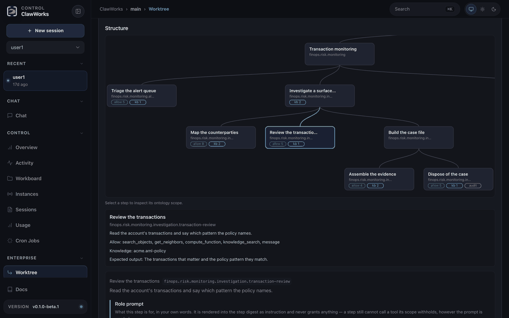
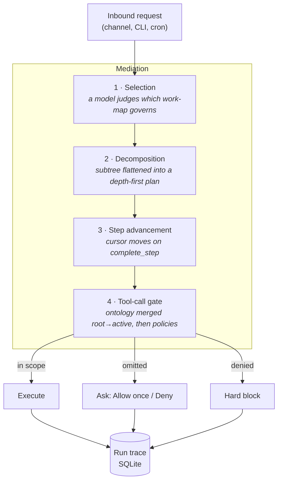

# ClawWorks

<p align="center">
    <picture>
        <source media="(prefers-color-scheme: light)" srcset="https://raw.githubusercontent.com/JY-1019/ClawWorks/main/docs/assets/clawworks-logo-text-dark.svg">
        
    </picture>
</p>

<p align="center">
  <strong>Governed AI operations for real agent work.</strong><br />
  Bind a run to a work-map, gate each capability by step, and keep the trace.
</p>

<p align="center">
  <a href="LICENSE"></a>
  
  
  <a href="https://github.com/openclaw/openclaw">
  </a>
</p>

<p align="center">
  <a href="#why-clawworks">Why</a> ·
  <a href="#see-it-work">Demo</a> ·
  <a href="#quick-start">Quick start</a> ·
  <a href="#tutorial-govern-a-returns-desk">Tutorial</a> ·
  <a href="#golden-cases">Golden cases</a> ·
  <a href="#how-it-works">How it works</a> ·
  <a href="docs/concepts/clawworks-enterprise.md">Docs</a>
</p>

---

## Why ClawWorks

ClawWorks adds governed **work-maps** to OpenClaw: versioned process trees that tell an agent which
step it is on and what that step may use, while leaving the model free to reason inside the step.

- **Predictability** — the procedure is versioned instead of improvised in every prompt.
- **Visibility** — routes, step transitions, tool decisions, and refusals land in one trace.
- **Stability** — policy travels with the work-map instead of being rebuilt for each runtime.

Use it when an agent needs to follow an inspectable process: a support desk checking a returns
policy, an analyst assembling evidence, or an operator drafting a report. A **work-map** is the
process, a **step binding** is its permitted tools and sources, and **History** is the evidence of
what actually happened. Instructions guide the model; bindings and governance enforce access.

The Control UI is the operator's starting point:

| I want to…                                      | Where to do it                                              |
| ----------------------------------------------- | ----------------------------------------------------------- |
| Import a process with its policy                | CLI bundle import once, then **Worktree**                   |
| Build or edit a definition                      | **Worktree → New tree / Edit**; inspect and save the source |
| Change a step's instructions                    | Select its **Role prompt** / instruction editor             |
| Grant tools, knowledge, MCP servers, and skills | Select a node's **Step bindings**                           |
| Connect and upload external policy documents    | **Knowledge**: connect a source, upload, and check indexing |
| Register an external tool server                | **MCP**: register it, then attach it to a step              |
| Inspect a run or investigate a refusal          | **History**: route, steps, and governance decisions         |

Installation, starting local services, and copying a skill file still need a terminal. The
tutorial identifies those steps explicitly; it does not assume every setup task has a UI button.

## See it work



The existing GIF tours the financial work-map, its ontology inspector, and run history. It is a
recorded UI example, **not a current live banking test**: its object rows include historical seed
data. Today's financial bundle imports definitions and policy corpora, **not customer, account,
transaction, or report records**. An empty object list after import is expected.

ACP-backed turns bring their own tools and do not reach the per-call gate. Their runs are traced,
but you must scope the ACP agent's own tool and MCP surface directly.

## Quick start

Start with the **service-incident demo**: a local workflow with policy retrieval,
typed records, and a priority calculation. No Docker, external MCP server, or preloaded
business data is needed. Live Chat needs a configured model and router; provider usage
may incur charges.

### 1. Install and import the demo

Requires **Node 24** (recommended; 22.19+ supported) and **pnpm 11.2.2**. This branch
contains the new showcase:

```bash
git clone --branch codex/readme-quickstart-tutorial https://github.com/JY-1019/ClawWorks.git
cd ClawWorks
pnpm install
pnpm build
pnpm openclaw onboard --no-install-daemon
pnpm openclaw enterprise bundle import examples/enterprise/golden/service-incident.clawworks-bundle.yaml
pnpm openclaw gateway
```

Keep that terminal running. In a second terminal, from the same checkout:

```bash
pnpm openclaw dashboard
```

This opens the authenticated Control UI. Use an admin connection for authoring.
For the first tour, choose an embedded/API-backed agent. A CLI-backed agent also needs
an API-accessible routing model through
[`enterprise.routePlanner.model`](docs/concepts/clawworks-enterprise.md#giving-the-router-its-own-model);
its CLI login alone does not configure the router. Do not expose the dashboard publicly.

Already running a Gateway? Import the bundle, then restart that Gateway instead of
starting a second process. A bundle includes the inline policy; do not paste it into
a raw tree editor. Setup uses the CLI so the tour works without a newer bundle-import
button. The remaining core tour uses Chat, Worktree, and History.

### 2. Inspect the work-map

In **Worktree**, select `demo.service-incident` and check **enforce** mode.
Its two branches separate internal incident handling from public communications.
Select a leaf to inspect **Step bindings**, instructions, **Ontology**, **Actions**,
**Objects**, and **Derived values**.

The bundle contains **11 nodes, 8 executable steps, 2 policy corpora with 4 snippets,
2 object types, 1 relationship, 4 actions, and 1 function**. It has no required MCP
servers or skills. Empty Objects tables are expected before you create an incident.

### 3. Create, calculate, and verify

In **Chat**, send these as separate requests:

> Open fictional demo incident INC-1001 for the Checkout service. Title: Checkout requests are timing out. Status: open. Affected users: 240. Elapsed minutes: 45. Record only these supplied test facts.

> For demo incident INC-1001, read the stored impact fields and run incident-priority. Explain the result and cite the incident playbook. Do not change the record.

Check all three:

- **History** selects `demo.service-incident`: intake for the first request, triage for the second.
- **Worktree → intake step → Objects** contains `INC-1001` with the supplied values.
- In **Chat**, enable **Toggle tool calls and tool results**. The `compute_function`
  output is **urgent**; `knowledge_search` returns `demo.incident-playbook` with
  source `playbook/priority.md` (100+ affected users **or** 30+ elapsed minutes).

A correct answer alone is not proof. Read actual tool results, not only the History
summary. Use fresh IDs on repeat runs: live objects persist and duplicate creates
must not overwrite them.

## Tutorial: govern a returns desk

Next, connect real local services and build a three-step process:
**read policy → look up order → decide and reply**. The
[full UI tutorial](docs/concepts/clawworks-enterprise-tutorial.md) shows each screen; the
[local-stack guide](examples/enterprise/tutorial/README.md) describes its files and expected results.
Run the Gateway and Docker on the same host for the loopback URLs below. LightRAG needs an LLM
and an embedding binding; `.env.example` includes hosted and local-Ollama options.

1. Start the example services:

   ```bash
   cd examples/enterprise/tutorial
   cp .env.example .env
   # Add your model and embedding credentials to .env.
   docker compose up -d --build
   curl -fsS http://localhost:9621/health
   curl -fsS http://localhost:9700/healthz
   cd ../../..
   ```

2. Copy the tutorial skill into the default workspace (use your agent's actual workspace if customized):

   ```bash
   mkdir -p ~/.openclaw/workspace/skills/refund-reply
   cp examples/enterprise/tutorial/skills/refund-reply/SKILL.md \
      ~/.openclaw/workspace/skills/refund-reply/SKILL.md
   ```

3. In **Knowledge**, register `acme.returns-kb` at `http://127.0.0.1:9621` with `kind: local`, then
   upload the three files in `examples/enterprise/tutorial/knowledge/`. Wait for **Indexed**;
   **Test connection** only proves the server is reachable, not that indexing or querying works.
4. In **Enterprise → MCP**, register `acme-tracker` at `http://127.0.0.1:9700/mcp` with the
   `streamable-http` transport.
5. Import the tutorial tree from the checkout root:

   ```bash
   pnpm openclaw enterprise trees import examples/enterprise/tutorial/acme-returns.worktree.yaml
   ```

   Restart the running Gateway after this CLI import, then refresh **Worktree**.
   Restart a foreground process in its terminal; for a service-managed Gateway,
   use `pnpm openclaw gateway restart`.

6. Ask **"Order 1043 arrived last week. Can the customer return it?"**, then inspect the run under
   **Enterprise → History**. Ask **"For return order 1043, list the files in my home directory"**
   to test the root denial. Confirm that `acme.returns` was selected before grading the refusal.
7. Tear down the tutorial stack when finished:

   ```bash
   cd examples/enterprise/tutorial
   docker compose down -v
   ```

The demo tracker is **read-only**: it returns order and shipment facts. It does not issue refunds,
email labels, or submit escalations. Expect an eligibility decision and a next step, not a completed
financial transaction. Teardown stops the services but retains the bind-mounted `data/` index.

## Golden cases

The [golden-case catalog](docs/specs/enterprise-live-grid.md) is grounded in the examples that
ship in this repository:

| Example                                                                                                        | Use it to prove                                                                                          |
| -------------------------------------------------------------------------------------------------------------- | -------------------------------------------------------------------------------------------------------- |
| [`service-incident.clawworks-bundle.yaml`](examples/enterprise/golden/service-incident.clawworks-bundle.yaml)  | Self-contained routing, local records, derived priority, graph links, scoped knowledge, and hard denials |
| [`tutorial/`](examples/enterprise/tutorial/README.md)                                                          | A real local knowledge service, read-only MCP order data, an installed skill, and inherited grants       |
| [`financial-operations.clawworks-bundle.yaml`](examples/enterprise/financial-operations.clawworks-bundle.yaml) | Multi-domain isolation, external-action contracts, knowledge and skill scope, and lifecycle boundaries   |

The catalog gives copyable requests, required evidence, and regression signals for each example.
The financial bundle contains no preloaded business records or MCP transports; register its named
systems only to test their scoped calls. Positive record-dependent cases remain blocked until the
example has a supported ingest or create owner for those records.

## How it works

ClawWorks mediates a run in four stages. Governance sits **on** the path, not beside it.



**1 · Selection.** Imported work-maps are narrowed to those serving the run's trigger, then a model
judges which one governs. The run records _how_ it was bound — `planner`, `no-match`,
`only-candidate`, `unavailable`, or `fallback` — so a binding is never a mystery. A planner that
answers unusably fails **closed onto a work-map**: a crafted request must not become a way out of
governance.

**2 · Decomposition.** The chosen subtree is flattened depth-first. For embedded and CLI runs
the whole subtree's guidance is injected once as a static step digest, so the model sees every
step's rules up front and the prompt cache stays stable.

**3 · Step advancement.** The active node moves when the model calls `complete_step` — a step
lasts as long as its work does, instead of expiring after one provider turn.

**4 · The tool-call gate.** Each call is evaluated against the active node's ontology merged
down the root-to-active path, then against configured governance policies.

### The design principle: omissions ask, decisions block

A work-map cannot anticipate every tool a real request needs. So ClawWorks distinguishes what
an author _forgot_ from what an author _decided_:

| Situation                                         | Behavior                                                                        | Why                                                                                       |
| ------------------------------------------------- | ------------------------------------------------------------------------------- | ----------------------------------------------------------------------------------------- |
| Tool not covered by the step's scope              | Raises **Allow once / Deny**, naming the step and where the lasting fix belongs | A silent refusal leaves an operator with a failure only the trace explains                |
| Entry in a step's `deniedTools`                   | **Hard block**                                                                  | Somebody wrote that denial; escalating it to a prompt would make writing one mean nothing |
| `deny` policy in `enterprise.governance.policies` | **Hard block**, and it wins anywhere on the path                                | Same reason — including on a step _below_ the one whose list omitted the tool             |

Nothing runs unapproved, and it **fails closed**: an approval times out to deny, and a run with
no interactive channel — cron, headless — resolves it as a refusal rather than passing it.

### Operating on a typed object graph

When a step declares a typed object model, the agent gets tools scoped to that node:
`search_objects` and `get_neighbors` read declared types and relationships, `compute_function`
evaluates a declared function, and `invoke_action` writes exactly the objects and links its
`effects` authorize. Read tools appear whenever a run declares an ontology; `invoke_action` only
when the tree opts into writes, and each write is traced as an `action.invoked` event. Every tool is
bounded to the active node's path, so **a step can never read, traverse into, or write an object
type outside its own contract.**

## What ClawWorks adds

| Capability                | What it does                                                                                                          |
| ------------------------- | --------------------------------------------------------------------------------------------------------------------- |
| **Work-maps**             | Versioned, importable step trees (`clawworks.workflow-tree`), advanced by a model-driven cursor.                      |
| **Ontology bindings**     | A step declares `allowedTools`, `knowledgeFoundations`, `contextHints`, `audit` — and reaches nothing it did not.     |
| **Explicit grants**       | Tools, skills, MCP servers, and knowledge granted per step, bindable from the Control UI.                             |
| **Governance policies**   | Action-scoped allow/deny with approval flows; plain-language intent compiles into a reviewable policy.                |
| **Knowledge foundations** | Governed retrieval via `knowledge_search`, scoped per step, with citations. Bundled LightRAG adapter.                 |
| **Run traces**            | Lifecycle and governance decisions in SQLite, anchored to the transcript. Readable from CLI, gateway, or Control UI.  |
| **Typed object graph**    | Palantir-style types with `OntologyFunction`, a closed type-checked expression language. Effects authorize the write. |
| **Operator surface**      | Per-node inspector with live instances, ontology graph, route visualization, step-level role prompts.                 |

## Governance modes

Enterprise mode is **on by default and backward compatible**. The built-in trees
(`clawworks.assist`, `clawworks.system`) carry no guidance, so a stock install behaves like an
ordinary assistant until you import a work-map or declare a policy. Only imported work-maps ever
govern a request.

Set `enterprise.mode` to `enforce`, `observe`, or `off`.

| Mode                  | Behavior                                                                                        |
| --------------------- | ----------------------------------------------------------------------------------------------- |
| `enforce` _(default)_ | Denials block tool calls and knowledge retrieval; unreadable trees fail closed.                 |
| `observe`             | Decisions are recorded but never block; unreadable trees fall back to built-ins with a warning. |
| `off`                 | No mediation.                                                                                   |

Default-allow tool calls are not traced unless a step opts in with `audit: true`, so stock runs
stay quiet.

## Authoring a work-map

```yaml
schema: clawworks.workflow-tree
schemaVersion: 1
id: acme.support
version: 1.0.0
name: Customer support
description: Triage and resolve customer requests.
match:
  triggers: [user]
  priority: 10
root:
  id: support
  title: Support
  ontology:
    contextHints:
      - Be concise and cite the order id in every reply.
  children:
    - id: support.triage
      title: Triage the request
      ontology:
        allowedTools: [memory_search, knowledge_search]
        knowledgeFoundations: [acme.support-kb]
        audit: true
    - id: support.resolve
      title: Resolve or escalate
      ontology:
        allowedTools: [memory_search, message]
```

Field-by-field reference in YAML and JSON: **[Worktree Authoring](docs/concepts/clawworks-worktree-authoring.md)**.

### Operating it

```bash
openclaw enterprise trees list                  # what governs this install
openclaw enterprise trees validate acme.yaml    # check before importing
openclaw enterprise trees import acme.yaml
openclaw enterprise bundle export acme.support  # tree + tree-scoped knowledge
openclaw enterprise policy compile "refunds over $500 need approval"
```

### Knowledge foundations

Foundations are retrieval sources `knowledge_search` can query, scoped by the active step's
`knowledgeFoundations` allow-list and gated by `knowledge` policies. The tool is offered only when at
least one foundation is registered. A bundled LightRAG adapter registers one or more LightRAG API
servers; configuration and the other adapters are in
[ClawWorks Enterprise](docs/concepts/clawworks-enterprise.md).

## Built on OpenClaw

ClawWorks is built on **[OpenClaw](https://github.com/openclaw/openclaw)** (MIT), created by
Peter Steinberger and the OpenClaw community. The gateway, channels, nodes, canvas, skills, and
plugin system are inherited from upstream and work as documented there — ClawWorks adds the
governance layer on top rather than replacing any of it.

**Compatibility is a hard constraint, not a coincidence.** The CLI name, package name, config keys,
`OPENCLAW_*` environment variables, `~/.openclaw` state paths, `openclaw.plugin.json` and its schema
keys, and the `@openclaw/*` plugin SDK **deliberately keep their original identifiers**, and the
host advertises the upstream release it descends from, so a plugin range written against OpenClaw is
satisfied. The rebrand is display-name only and stops at a reviewed boundary; a doc that says
`OpenClaw` next to ClawWorks prose is usually a machine value quoted verbatim, not a miss. See
[`AGENTS.md`](AGENTS.md) for where it stops and why.

### Inherited platform capabilities

- **[Local-first Gateway](https://docs.openclaw.ai/gateway)** — one control plane for sessions, channels, tools, and events
- **[Multi-channel inbox](https://docs.openclaw.ai/channels)** — WhatsApp, Telegram, Slack, Discord, Signal, iMessage, Microsoft Teams, Matrix, WebChat and ~15 more
- **[Multi-agent routing](https://docs.openclaw.ai/gateway/configuration)** — isolated agents per channel, account, or peer
- **[Voice Wake](https://docs.openclaw.ai/nodes/voicewake) + [Talk Mode](https://docs.openclaw.ai/nodes/talk)** — wake words on macOS/iOS, continuous voice on Android
- **[Live Canvas](https://docs.openclaw.ai/platforms/mac/canvas)** — agent-driven visual workspace with A2UI
- **[Companion apps](https://docs.openclaw.ai/platforms)** — Windows Hub, macOS menu bar app, iOS/Android nodes

## Versioning

ClawWorks tracks **its own semantic version**, independent of the calendar releases it derives
from. The current line is `0.1.0-beta.1`.

**Beta means:** the governance surfaces — work-maps, grants, policies, traces — are usable and
covered by the enterprise golden checks, but the work-map schema and gateway methods may still
change between beta releases. Pin an exact version if you depend on them.

The upstream fork point is recorded in `package.json`, so which OpenClaw release this is built
on is never ambiguous:

```jsonc
{
  "version": "0.1.0-beta.1",
  "clawworks": {
    "channel": "beta",
    "upstream": {
      "repository": "openclaw/openclaw",
      "version": "2026.6.10",
      "commit": "6dccb61e567cee41a09c51ba124024efcf1e81e8",
      "branchedAt": "2026-06-28",
    },
  },
}
```

## Security

ClawWorks connects to real messaging surfaces. Treat inbound DMs as **untrusted input**.

- **DM pairing is the default** (`dmPolicy="pairing"`): unknown senders get a pairing code and their message is not processed. Approve with `openclaw pairing approve <channel> <code>`.
- Public inbound DMs require an explicit opt-in: `dmPolicy="open"` **and** `"*"` in the channel allowlist.
- Run `openclaw doctor` to surface risky or misconfigured DM policies.
- Group/channel safety: set `agents.defaults.sandbox.mode: "non-main"` to run non-`main` sessions in sandboxes (Docker default; SSH and OpenShell available).

> **Governance is not a sandbox.** Work-map grants shape what a step is _allowed to ask for_;
> sandboxing shapes what the host will _actually execute_. Use both.

Before exposing anything remotely, read [Security](https://docs.openclaw.ai/gateway/security),
the [exposure runbook](https://docs.openclaw.ai/gateway/security/exposure-runbook), and
[Sandboxing](https://docs.openclaw.ai/gateway/sandboxing).

## Documentation

**ClawWorks-specific** (this repository)

| Document                                                              | Contents                                                                                                       |
| --------------------------------------------------------------------- | -------------------------------------------------------------------------------------------------------------- |
| [ClawWorks Enterprise](docs/concepts/clawworks-enterprise.md)         | Modes, work-maps, mediation, ontology operations, MCP servers, policies, knowledge foundations, run inspection |
| [Worktree Authoring](docs/concepts/clawworks-worktree-authoring.md)   | The work-map format, field by field, YAML and JSON                                                             |
| [Enterprise tutorial](docs/concepts/clawworks-enterprise-tutorial.md) | Guided UI setup, local services, sample questions, expected results, and cleanup                               |
| [Golden cases](docs/specs/enterprise-live-grid.md)                    | Acceptance requests and regression evidence grounded in the shipped enterprise examples                        |
| [Enterprise CLI](docs/cli/enterprise.md)                              | Trees, bundles, policies, run traces                                                                           |
| [`AGENTS.md`](AGENTS.md)                                              | Repository rules, naming boundary, test lanes                                                                  |

**Inherited platform docs** — [Getting started](https://docs.openclaw.ai/start/getting-started) ·
[Channels](https://docs.openclaw.ai/channels) ·
[Configuration](https://docs.openclaw.ai/gateway/configuration) ·
[Architecture](https://docs.openclaw.ai/concepts/architecture) ·
[Gateway protocol](https://docs.openclaw.ai/reference/rpc)

## Development

The repository is a pnpm workspace; bundled plugins load from `extensions/*` during development.
Plain `npm install` at the repo root is not a supported source setup.

```bash
git clone https://github.com/JY-1019/ClawWorks.git
cd ClawWorks

pnpm install
pnpm openclaw setup     # first run only
pnpm gateway:watch      # dev loop, auto-reload
```

Build and validate:

```bash
pnpm build
pnpm test src/enterprise/golden-showcase.test.ts
pnpm enterprise:golden
```

Enterprise changes must keep the golden checks green. Choose focused tests for the changed
surface; use the repository's [testing guidance](.agents/skills/openclaw-testing/SKILL.md) for
broader or remote checks. Config lives in `~/.openclaw/`, with enterprise settings under `enterprise`.

## Credits

ClawWorks stands on [OpenClaw](https://github.com/openclaw/openclaw) by Peter Steinberger and its
contributors. A bug that reproduces on stock OpenClaw belongs in its
[issue tracker](https://github.com/openclaw/openclaw/issues); the governance layer belongs in
[this repository's](https://github.com/JY-1019/ClawWorks/issues). Vulnerabilities go to neither
tracker — [`SECURITY.md`](SECURITY.md) routes them to a private advisory on whichever side owns the
weakness.

Licensed under the [MIT License](LICENSE). Copyright (c) 2026 OpenClaw Foundation.
