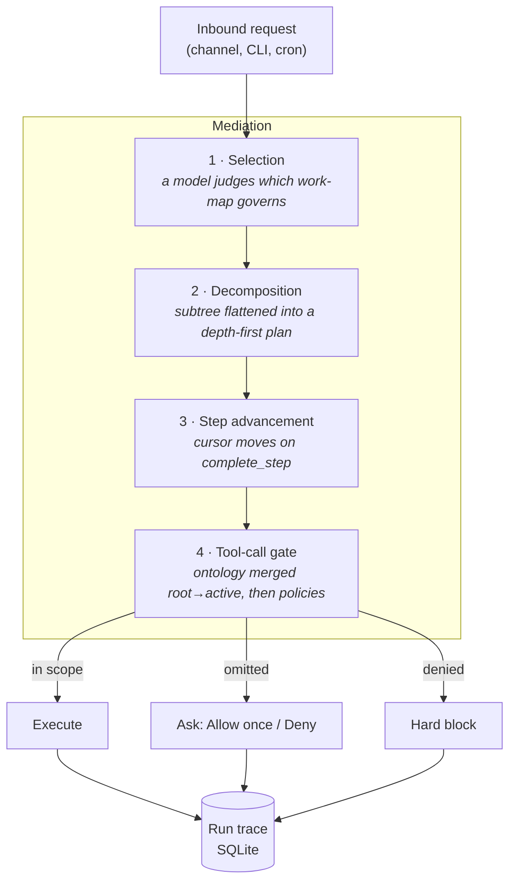

# ClawWorks

<p align="center">
    <picture>
        <source media="(prefers-color-scheme: light)" srcset="https://raw.githubusercontent.com/JY-1019/ClawWorks/main/docs/assets/clawworks-logo-text-dark.svg">
        
    </picture>
</p>

<p align="center">
  <strong>Governed AI operations.</strong><br />
  Every agent run bound to a work-map, gated by policy, written to an audit trace.
</p>

<p align="center">
  <a href="LICENSE"></a>
  
  
  <a href="https://github.com/openclaw/openclaw">
  </a>
</p>

<p align="center">
  <a href="#why-this-exists">Why</a> ·
  <a href="#how-it-works">How it works</a> ·
  <a href="#what-it-looks-like">Screens</a> ·
  <a href="#quick-start">Quick start</a> ·
  <a href="#authoring-a-work-map">Authoring</a> ·
  <a href="#built-on-openclaw">Upstream</a> ·
  <a href="docs/concepts/clawworks-enterprise.md">Docs</a>
</p>

---

## Why this exists

Most agent tooling is a **harness**: it holds the model's tools, its context, and its loop. That
solves a real problem, and ClawWorks keeps all of it — it is built on one.

What a harness does not carry is the **work**. It knows which tools exist; it does not know which
step of your process a run is on, what that step is allowed to touch, or how the last run of it
went. For one person exploring, that is fine. For an organization putting an agent in front of its
own records, it is usually what decides whether the thing can be deployed at all.

Three questions tend to come before capability does:

- **Predictability** — will tomorrow's run behave like today's, or does it turn on how the request
  happened to be phrased?
- **Visibility** — afterward, which step was it on, what did it reach, and what was refused?
- **Stability** — when a rule changes, does it change in one reviewable place, or across prompts?

ClawWorks answers those by binding a run to a **work-map**: a versioned tree of steps, where each
step declares the tools, skills, MCP servers, and knowledge it may reach. The gate that answers "may
this step do this?" sits on the execution path, and every decision it makes lands in a trace.

### Harness and work-map

The two are not alternatives. The loop still reasons freely inside a step; what stops being
improvised turn by turn is _what the run is doing_.

|                       | A harness                      | A work-map on top of it                       |
| --------------------- | ------------------------------ | --------------------------------------------- |
| What it models        | The model's turn               | A step of a process                           |
| Bounds a tool call by | How the agent was configured   | What _this step_ declared                     |
| Where the rules live  | Prompt text and runtime config | A versioned tree, imported and diffable       |
| Changing runtime      | Rules re-expressed per harness | Rules travel with the work-map                |
| After the run         | A transcript to read           | Bindings, transitions, and decisions to query |

The honest limit is worth stating up front: a gate has to be _reached_. A runtime that brings its
own tools — an ACP-backed turn — never reaches the per-call gate, so scope that agent itself rather
than trusting a grant to hold it.

## How it works

ClawWorks mediates a run in four stages. Governance sits **on** the path, not beside it.



**1 · Selection.** Imported work-maps are narrowed to those serving the run's trigger, then a model
judges which one governs. The run records _how_ it was bound — `planner`, `no-match`,
`only-candidate`, `unavailable`, or `fallback` — so a binding is never a mystery. A planner that
answers unusably fails **closed onto a work-map**: a crafted request must not become a way out of
governance.

**2 · Decomposition.** The chosen subtree is flattened depth-first. For embedded and CLI runs
the whole subtree's guidance is injected once as a static step digest, so the model sees every
step's rules up front and the prompt cache stays stable.

**3 · Step advancement.** The active node moves when the model calls `complete_step` — a step
lasts as long as its work does, instead of expiring after one provider turn.

**4 · The tool-call gate.** Each call is evaluated against the active node's ontology merged
down the root-to-active path, then against configured governance policies.

### The design principle: omissions ask, decisions block

A work-map cannot anticipate every tool a real request needs. So ClawWorks distinguishes what
an author _forgot_ from what an author _decided_:

| Situation                                         | Behavior                                                                        | Why                                                                                       |
| ------------------------------------------------- | ------------------------------------------------------------------------------- | ----------------------------------------------------------------------------------------- |
| Tool not covered by the step's scope              | Raises **Allow once / Deny**, naming the step and where the lasting fix belongs | A silent refusal leaves an operator with a failure only the trace explains                |
| Entry in a step's `deniedTools`                   | **Hard block**                                                                  | Somebody wrote that denial; escalating it to a prompt would make writing one mean nothing |
| `deny` policy in `enterprise.governance.policies` | **Hard block**, and it wins anywhere on the path                                | Same reason — including on a step _below_ the one whose list omitted the tool             |

Nothing runs unapproved, and it **fails closed**: an approval times out to deny, and a run with
no interactive channel — cron, headless — resolves it as a refusal rather than passing it.

### Operating on a typed object graph

When a step declares a typed object model, the agent gets tools scoped to that node:
`search_objects` and `get_neighbors` read declared types and relationships, `compute_function`
evaluates a declared function, and `invoke_action` writes exactly the objects and links its
`effects` authorize. Read tools appear whenever a run declares an ontology; `invoke_action` only
when the tree opts into writes, and each write is traced as an `action.invoked` event. Every tool is
bounded to the active node's path, so **a step can never read, traverse into, or write an object
type outside its own contract.**

## What it looks like

Screens below are the Control UI against a running gateway, governing an imported
`acme.financial-operations` work-map.

**The work-map, and what each step may reach.** Every step carries its own grants: the badges on
the graph are the counts, and selecting one spells out the allow-list, the knowledge foundations,
and what the step is expected to produce. That panel is not documentation — it is the scope the
gate reads on every tool call.


**The run trace.** A governed run records how it was bound and why. Here the planner chose one of
46 steps and wrote its reasoning into `route.selected`; each subsequent tool call lands as a
`governance.decision` naming the step that authorized it.


**The typed object graph.** A step that declares an object model gets tools scoped to it, and the
inspector shows both the declared types and the instances currently in the store.


## What ClawWorks adds

| Capability                | What it does                                                                                                          |
| ------------------------- | --------------------------------------------------------------------------------------------------------------------- |
| **Work-maps**             | Versioned, importable step trees (`clawworks.workflow-tree`), advanced by a model-driven cursor.                      |
| **Ontology bindings**     | A step declares `allowedTools`, `knowledgeFoundations`, `contextHints`, `audit` — and reaches nothing it did not.     |
| **Explicit grants**       | Tools, skills, MCP servers, and knowledge granted per step, bindable from the Control UI.                             |
| **Governance policies**   | Action-scoped allow/deny with approval flows; plain-language intent compiles into a reviewable policy.                |
| **Knowledge foundations** | Governed retrieval via `knowledge_search`, scoped per step, with citations. Bundled LightRAG adapter.                 |
| **Run traces**            | Lifecycle and governance decisions in SQLite, anchored to the transcript. Readable from CLI, gateway, or Control UI.  |
| **Typed object graph**    | Palantir-style types with `OntologyFunction`, a closed type-checked expression language. Effects authorize the write. |
| **Operator surface**      | Per-node inspector with live instances, ontology graph, route visualization, step-level role prompts.                 |

## Governance modes

Enterprise mode is **on by default and backward compatible**. The built-in trees
(`clawworks.assist`, `clawworks.system`) carry no guidance, so a stock install behaves like an
ordinary assistant until you import a work-map or declare a policy. Only imported work-maps ever
govern a request.

Set `enterprise.mode` to `enforce`, `observe`, or `off`.

| Mode                  | Behavior                                                                                        |
| --------------------- | ----------------------------------------------------------------------------------------------- |
| `enforce` _(default)_ | Denials block tool calls and knowledge retrieval; unreadable trees fail closed.                 |
| `observe`             | Decisions are recorded but never block; unreadable trees fall back to built-ins with a warning. |
| `off`                 | No mediation.                                                                                   |

Default-allow tool calls are not traced unless a step opts in with `audit: true`, so stock runs
stay quiet.

## Quick start

Runtime: **Node 24 (recommended) or Node 22.19+**.

```bash
npm install -g openclaw@latest
openclaw onboard --install-daemon
```

Onboard installs the Gateway daemon (launchd/systemd user service) and walks you through the
gateway, workspace, channels, and skills. Works on **macOS, Linux, and Windows**.

Then try the shipped example. `clawworks.support` ("Customer support") is a guidance-bearing
demo — adopt it by exporting and importing it back:

```bash
openclaw enterprise trees export clawworks.support --out support.yaml
openclaw enterprise trees import support.yaml
```

Run something through it, then read what happened:

```bash
openclaw enterprise runs list          # governed run history
openclaw enterprise runs show <runId>  # step transitions, grants, denials
```

## Authoring a work-map

```yaml
schema: clawworks.workflow-tree
schemaVersion: 1
id: acme.support
version: 1.0.0
name: Customer support
description: Triage and resolve customer requests.
match:
  triggers: [user]
  priority: 10
root:
  id: support
  title: Support
  ontology:
    contextHints:
      - Be concise and cite the order id in every reply.
  children:
    - id: support.triage
      title: Triage the request
      ontology:
        allowedTools: [memory_search, knowledge_search]
        knowledgeFoundations: [acme.support-kb]
        audit: true
    - id: support.resolve
      title: Resolve or escalate
      ontology:
        allowedTools: [memory_search, message]
```

Field-by-field reference in YAML and JSON: **[Worktree Authoring](docs/concepts/clawworks-worktree-authoring.md)**.

### Operating it

```bash
openclaw enterprise trees list                  # what governs this install
openclaw enterprise trees validate acme.yaml    # check before importing
openclaw enterprise trees import acme.yaml
openclaw enterprise bundle export acme.support  # tree + tree-scoped knowledge
openclaw enterprise policy compile "refunds over $500 need approval"
```

### Knowledge foundations

Foundations are retrieval sources `knowledge_search` can query, scoped by the active step's
`knowledgeFoundations` allow-list and gated by `knowledge` policies. The tool is offered only when at
least one foundation is registered. A bundled LightRAG adapter registers one or more LightRAG API
servers; configuration and the other adapters are in
[ClawWorks Enterprise](docs/concepts/clawworks-enterprise.md).

## Built on OpenClaw

ClawWorks is built on **[OpenClaw](https://github.com/openclaw/openclaw)** (MIT), created by
Peter Steinberger and the OpenClaw community. The gateway, channels, nodes, canvas, skills, and
plugin system are inherited from upstream and work as documented there — ClawWorks adds the
governance layer on top rather than replacing any of it.

**Compatibility is a hard constraint, not a coincidence.** The CLI name, package name, config keys,
`OPENCLAW_*` environment variables, `~/.openclaw` state paths, `openclaw.plugin.json` and its schema
keys, and the `@openclaw/*` plugin SDK **deliberately keep their original identifiers**, and the
host advertises the upstream release it descends from, so a plugin range written against OpenClaw is
satisfied. The rebrand is display-name only and stops at a reviewed boundary; a doc that says
`OpenClaw` next to ClawWorks prose is usually a machine value quoted verbatim, not a miss. See
[`AGENTS.md`](AGENTS.md) for where it stops and why.

### Inherited platform capabilities

- **[Local-first Gateway](https://docs.openclaw.ai/gateway)** — one control plane for sessions, channels, tools, and events
- **[Multi-channel inbox](https://docs.openclaw.ai/channels)** — WhatsApp, Telegram, Slack, Discord, Signal, iMessage, Microsoft Teams, Matrix, WebChat and ~15 more
- **[Multi-agent routing](https://docs.openclaw.ai/gateway/configuration)** — isolated agents per channel, account, or peer
- **[Voice Wake](https://docs.openclaw.ai/nodes/voicewake) + [Talk Mode](https://docs.openclaw.ai/nodes/talk)** — wake words on macOS/iOS, continuous voice on Android
- **[Live Canvas](https://docs.openclaw.ai/platforms/mac/canvas)** — agent-driven visual workspace with A2UI
- **[Companion apps](https://docs.openclaw.ai/platforms)** — Windows Hub, macOS menu bar app, iOS/Android nodes

## Versioning

ClawWorks tracks **its own semantic version**, independent of the calendar releases it derives
from. The current line is `0.1.0-beta.1`.

**Beta means:** the governance surfaces — work-maps, grants, policies, traces — are usable and
covered by the enterprise golden checks, but the work-map schema and gateway methods may still
change between beta releases. Pin an exact version if you depend on them.

The upstream fork point is recorded in `package.json`, so which OpenClaw release this is built
on is never ambiguous:

```jsonc
{
  "version": "0.1.0-beta.1",
  "clawworks": {
    "channel": "beta",
    "upstream": {
      "repository": "openclaw/openclaw",
      "version": "2026.6.10",
      "commit": "6dccb61e567cee41a09c51ba124024efcf1e81e8",
      "branchedAt": "2026-06-28",
    },
  },
}
```

## Security

ClawWorks connects to real messaging surfaces. Treat inbound DMs as **untrusted input**.

- **DM pairing is the default** (`dmPolicy="pairing"`): unknown senders get a pairing code and their message is not processed. Approve with `openclaw pairing approve <channel> <code>`.
- Public inbound DMs require an explicit opt-in: `dmPolicy="open"` **and** `"*"` in the channel allowlist.
- Run `openclaw doctor` to surface risky or misconfigured DM policies.
- Group/channel safety: set `agents.defaults.sandbox.mode: "non-main"` to run non-`main` sessions in sandboxes (Docker default; SSH and OpenShell available).

> **Governance is not a sandbox.** Work-map grants shape what a step is _allowed to ask for_;
> sandboxing shapes what the host will _actually execute_. Use both.

Before exposing anything remotely, read [Security](https://docs.openclaw.ai/gateway/security),
the [exposure runbook](https://docs.openclaw.ai/gateway/security/exposure-runbook), and
[Sandboxing](https://docs.openclaw.ai/gateway/sandboxing).

## Documentation

**ClawWorks-specific** (this repository)

| Document                                                            | Contents                                                                                                       |
| ------------------------------------------------------------------- | -------------------------------------------------------------------------------------------------------------- |
| [ClawWorks Enterprise](docs/concepts/clawworks-enterprise.md)       | Modes, work-maps, mediation, ontology operations, MCP servers, policies, knowledge foundations, run inspection |
| [Worktree Authoring](docs/concepts/clawworks-worktree-authoring.md) | The work-map format, field by field, YAML and JSON                                                             |
| [Enterprise CLI](docs/cli/enterprise.md)                            | Trees, bundles, policies, run traces                                                                           |
| [`AGENTS.md`](AGENTS.md)                                            | Repository rules, naming boundary, test lanes                                                                  |

**Inherited platform docs** — [Getting started](https://docs.openclaw.ai/start/getting-started) ·
[Channels](https://docs.openclaw.ai/channels) ·
[Configuration](https://docs.openclaw.ai/gateway/configuration) ·
[Architecture](https://docs.openclaw.ai/concepts/architecture) ·
[Gateway protocol](https://docs.openclaw.ai/reference/rpc)

## Development

The repository is a pnpm workspace; bundled plugins load from `extensions/*` during development.
Plain `npm install` at the repo root is not a supported source setup.

```bash
git clone https://github.com/JY-1019/ClawWorks.git
cd ClawWorks

pnpm install
pnpm openclaw setup     # first run only
pnpm gateway:watch      # dev loop, auto-reload
```

Build and validate:

```bash
pnpm build
pnpm check
pnpm test
```

Enterprise changes must keep the golden checks green. Config lives in `~/.openclaw/`, with
enterprise settings under the `enterprise` section.

## Credits

ClawWorks stands on [OpenClaw](https://github.com/openclaw/openclaw) by Peter Steinberger and its
contributors. A bug that reproduces on stock OpenClaw belongs in its
[issue tracker](https://github.com/openclaw/openclaw/issues); the governance layer belongs in
[this repository's](https://github.com/JY-1019/ClawWorks/issues). Vulnerabilities go to neither
tracker — [`SECURITY.md`](SECURITY.md) routes them to a private advisory on whichever side owns the
weakness.

Licensed under the [MIT License](LICENSE). Copyright (c) 2026 OpenClaw Foundation.
